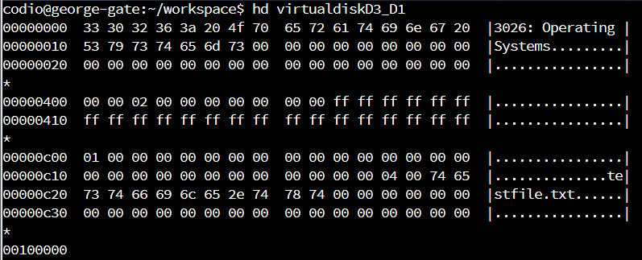

## How to run:

### On Windows:

1. Install a C compiler or check if you already have one installed by typing *“gcc -v”*.
2. Open a linux-like terminal such as *Cygwin* and navigate to the directory where the program is saved using *“cd”*.
3. Type *“make”* which will both compile and run the program using a makefile.

### On Linux:

1. Make sure you have the *“build-essential”* package installed on your linux machine.
2. Type the command *“make”* in order to compile and run the program.

To hexdump the contents of "virtualdiskC3\_C1" use the command *“hd virtualdiskC3\_C1”*

## Layout of the Virtual Disk

This assessment implements a simple FAT-based file/directory management system that uses an in-memory disk. It allows users to create files and directories as well as read from and write to the virtual disk.

- Block 0 - reserved and can contain any information about the file system on the disk. In our case we will save the name of the disk (“virtualdiskD3\_D1”) into those first 1024 bytes.
- Block 1 and 2 - hold the FAT. We need 2 blocks, because each FAT entry takes up 2 bytes, multiplied by 1024 entries that equals 2048 bytes, which are 2 blocks of disk space.
- Block 3 - the root directory, marked by its block starting with 01.
- Blocks 4 to 1023 - data or directory blocks.

The disk is represented by an array of 1024 memory blocks(MAXBLOCKS), where a block is an array of 1024 bytes each(BLOCKSIZE). The status of each block(allocated or unallocated) is recorded in the FAT. As files may occupy more than one disk block, the FAT records the block-chain of blocks that make up a file. When reading a file, we read the blocks in the order specified by the FAT.

Blocks can be of the following types:

- FAT block - contains information about used and unused blocks, similar to a contents list in a book
- data block - an array containing files or data
- directory block - a list of directory entries

## Functions and functionality

void format() - creates the structure for the virtual disk and writes the FAT and the root directory on the virtual disk. Creates an empty data block for the 0 block to save the name of the volume on the disk("3026: Operating Systems"). After this the FAT table is created and blocks 0 through 1023 are recorded in the FAT table as allocated/unallocated accordingly, including block 0, block 1 and 2 for the FAT itself and block 3 containing the root directory. Next, the root directory is created at block 3.

void copy\_fat(fatentry\_t \*FAT) - saves FAT entries into the FAT table.

MyFILE \* myfopen ( const char \* filename, const char \* mode ) - opens files from the virtual disk and can be called in either “r”(read-only) or “w”(write/read/append) mode. The function checks whether the file we are looking for exists on the virtual disk and if it does not succeed, it creates the file by looking for a free space to save it and updating the FAT table with the FAT entry for the file.

void myfclose ( MyFILE \* stream ) - closes the file.

Hexdump of the virtual disk "virtualdiskC3\_C1" can be seen below:

